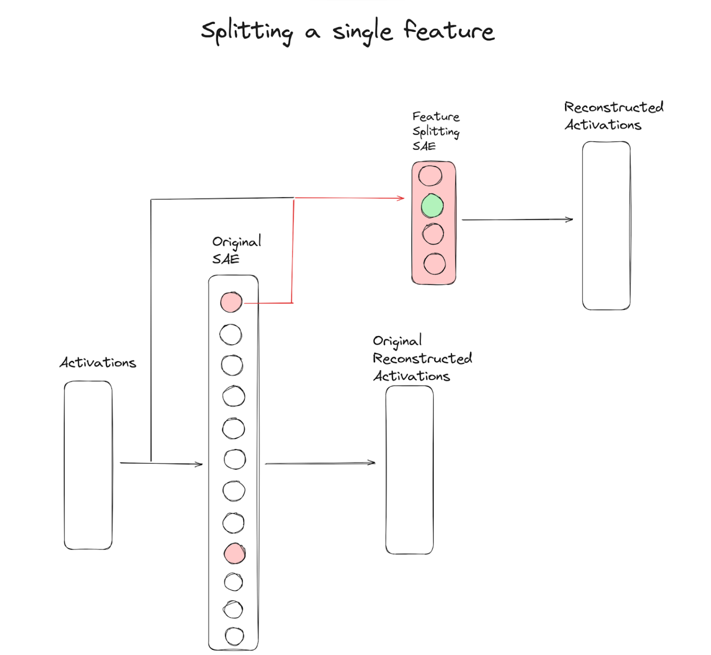
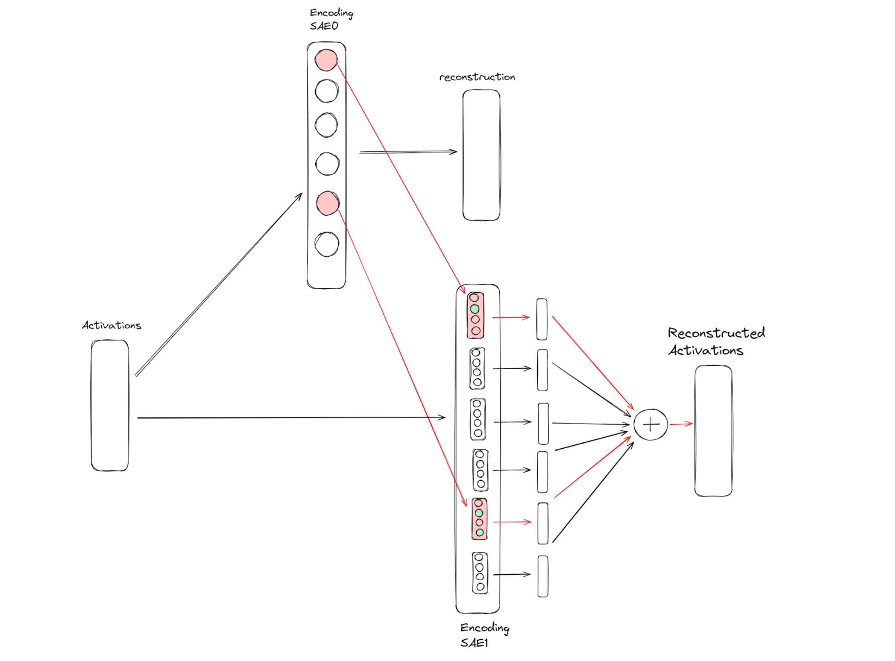

This is working, but still under active development. 

Work started in Neel Nanda's MATS stream's training and research sprint

Initial investigations:

What this is:

### Contributors
- Glen M. Taggart
- Bart Bussman
- Keith Wynroe/
- Neel Nanda
- Callum McDougall

Keith Wynroe and I (Glen Taggart) pair programmed the initial implementation one night, of a standard (not hierarchical) sparse autoencoder and got it most of the way running.
That part of the project was based off of this colab: https://colab.research.google.com/drive/1MjF_5-msnSe5F9Qy4kEGSeqyYPE9_D2p?authuser=1#scrollTo=7WXAjU3mRak6 which I am told Bart Bussman adapted from Neel Nanda's code.
That code has evolved a lot since then and the initial seed has been split across multiple files. I worked on it more afterwards, and then Bart Bussman and I began working on the hierarchical features and feature splitting problem together. Bart and I (Glen Taggart) pair programmed some of this during the MATS research sprint. Most of the code I (Glen Taggart) wrote alone, due to timezone difference. Bart also majorly contributed to this work through analysis and synthesis of results, early investigations that demonstrated that the path was promising and worth continuing to pursue despite the difficulty, and discussions that led to important insights on features and architectural decisions.

Callum was our TA in the MATS program and helped us clarify a lot of our model of the situation and implementation so I want to acknowledge him here.

Neel Nanda contributed seed code and was our

